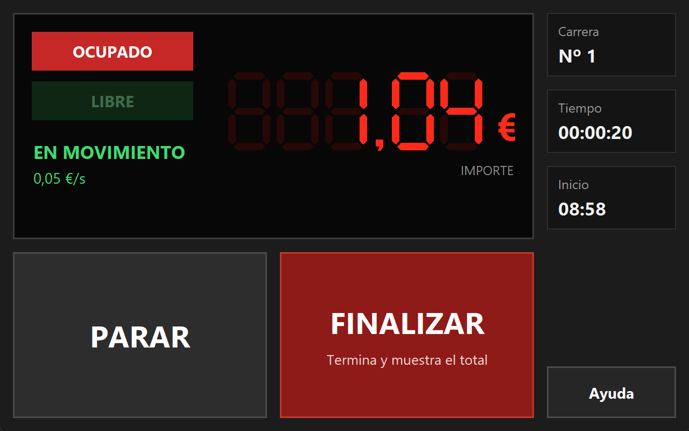

🇬🇧 **English** · [🇪🇸 Español](README.es.md)

# 🚕 TTX-247 Taxímetro

<p align="center">
  
</p>

## 📑 Contents

- [What is it?](#what-is-it)
- [What can I do with it?](#what-can-i-do-with-it)
- [Status](#status)
- [How can I try it?](#how-can-i-try-it)
- [How it's built](#how-its-built)
  - [Tech stack](#tech-stack)
  - [Architecture](#architecture)
  - [Design decisions](#design-decisions)
- [How I work](#how-i-work)
- [Documentation](#documentation)
- [Author](#author)
- [License](#license)

<a id="what-is-it"></a>
## ❓ What is it?

A software taxi meter. The fictional client, **TaxiTech Solutions**, runs taxis with physical Hale T200 meters that have been unsupported since 2023 and keep failing. This project replaces them with a program that charges a ride by the **time** the taxi spends in each state, not by distance:

| Taxi state | Rate |
|---|---:|
| Stopped, or speed < 20 km/h | `€0.02 / second` |
| Moving | `€0.05 / second` |

It is a course project, built in phases with a demo at the end of each. It is meant to be **read, not used to charge real rides**.

<a id="what-can-i-do-with-it"></a>
## ✨ What can I do with it?



*The GUI mid-ride: ride nº 1, taxi occupied and moving, amount ticking at €0.05/s. The interface text is in Spanish because the client is in Madrid.*

- **Charge a ride as a driver:** start a ride, switch between stopped and moving, watch the amount grow in real time, and finish it to get the total.
- **Not lose a ride by accident:** finishing (or closing the window) asks for confirmation, and the amount freezes at the moment you press.
- **Manage it as an administrator** (password protected): change the fares and see today's rides with the cash total.
- **Use it two ways:** a touch **GUI** or a **CLI**, both on the same logic.
- **Keep a record:** every finished ride is saved to a CSV history, and everything that happens is written to a rotating log file.

<a id="status"></a>
## 📊 Status

| | |
|---|---|
| **Build** |   |
| **Quality** |    |
| **Packages** |     |
| **Progress** |    |
| **License** |  |

*Coverage and test count are a snapshot from 2026-09-25 (`pytest`); CI, last commit, issues and PRs update by themselves. The run fails below 90% coverage.*

| Phase | Content | Status |
|---|---|---|
| 1 | Command-line MVP: start, stop/go and finish a ride, with the amount (US-01 to US-04) | ✅ Frozen in the `fase-1` branch for the demo |
| 2 | Configurable fares, ride history and logs (US-05 to US-07) | ✅ |
| 3 | Admin password, touch GUI and refactoring (US-08, US-09) | ✅ |
| 4 | Database, REST API and one-command deploy | ⏳ Not started |

Phases 1 to 3 are in the `dev` branch. The client's original brief is in [`docs/project-brief.md`](docs/project-brief.md) (Spanish); tasks are in [`Backlog.md`](Backlog.md) and on the [project board](https://github.com/orgs/IA-P1-BCN/projects/2).

<a id="how-can-i-try-it"></a>
## ▶️ How can I try it?

Requirements: Python 3.10 or later. The app uses the standard library only; the GUI uses `tkinter`, which ships with Python on Windows and macOS (on Linux: `sudo apt install python3-tk`).

```bash
git clone https://github.com/IA-P1-BCN/Proyecto1_Manon.git
cd Proyecto1_Manon
python -m venv .venv
source .venv/bin/activate              # Windows: .venv\Scripts\activate
pip install -r requirements-dev.txt    # only needed for the tests

python -m taximetro                    # graphical interface
python -m taximetro.taximetro_app      # CLI
pytest                                 # the tests
```

Run it from the repository root: fares, history and logs are stored in `config/`, `data/` and `logs/` relative to it. To enter as Administrator, the demo password is **`taxi`**.

For a guided tour with what to press and what you should see, there are demo scripts (in Spanish): [phase 1](docs/demo-fase1.md), [phase 2](docs/demo-fase2.md) and [phase 3](docs/demo-fase3.md). The GUI tests open real windows (CI provides a display with `xvfb-run`) and check that no screen cuts off a text or pushes anything out of place.

<a id="how-its-built"></a>
## 🏗️ How it's built

<a id="tech-stack"></a>
### Tech stack

<p>
  
  <br />
  
  
</p>

- **Python**, object-oriented, standard library only at runtime (`hashlib.scrypt` for the password, `csv` for the history, `logging` for the logs).
- **tkinter** for the touch GUI.
- **pytest** and **pytest-cov** for 600+ tests with 99% coverage.
- **Git and GitHub**, with **GitHub Actions** running the tests on every push and pull request (with `xvfb` to give the GUI tests a display).

<a id="architecture"></a>
### Architecture

```
Proyecto1_Manon/
├── taximetro/                    # the application
│   ├── carrera.py                # a ride, its state and its amount
│   ├── tarifa.py                 # € per second by state, validated
│   ├── taximetro.py              # active ride, fare and injected clocks
│   ├── config_tarifas.py         # fares in config/tarifas.json
│   ├── historial.py              # finished rides in data/historial.csv
│   ├── auth.py                   # password checked against a scrypt hash
│   ├── logs.py                   # logs/taximetro.log with rotation
│   ├── servicio_taximetro.py     # the only thing both interfaces use
│   ├── taximetro_app.py          # CLI interface
│   ├── utils.py                  # euro formatting
│   ├── __main__.py               # python -m taximetro → the GUI
│   └── gui/                      # tkinter GUI, one screen per module
├── tests/                        # one file per module (tests/gui/ for the GUI)
├── config/                       # fare file format, password salt + hash
├── docs/                         # brief, flows, design, decisions, demo scripts
├── .github/workflows/tests.yml   # CI: pytest + coverage
├── Backlog.md                    # tasks, linked to the GitHub issues
├── pyproject.toml                # pytest and coverage settings
└── requirements-dev.txt          # test dependencies
```

<a id="design-decisions"></a>
### Design decisions

- **One logic, two interfaces.** The CLI and the GUI talk only to `ServicioTaximetro`, which returns data and never live domain objects. A test fails if an interface imports anything else. In Phase 4 that service can be swapped for an API client without touching the screens.
- **Two injected clocks.** A monotonic one to compute the amount (a wall clock can jump backwards and undercharge) and a calendar one for start and end times. This is what keeps the tests fast and deterministic.
- **The password is never stored.** `config/credenciales.json` holds only a salt and the `scrypt` hash, so it can live in the repository.
- **The amount freezes when you press Finish.** The rider pays what the meter showed at that instant, not what it showed by the time they confirmed.
- **One class per file**, domain vocabulary in Spanish, and money formatting in a single place (`utils.formato_euros`).

<a id="how-i-work"></a>
## 🛠️ How I work

- **One branch per user story** off `dev`, with a PR and green CI before merging; `main` only receives a demoable version per phase. Each phase is frozen in its own branch (`fase-1`, `fase-2`, `fase-3`) as a reference point for its demo.
- **Conventional Commits** that cite the story or task (`feat(carrera): ... (US-02)`).
- **Tests written alongside the code**, with a 90% coverage gate in CI.
- **Decisions are written down** before behaviour changes, with the reasoning and what was rejected; postponed ideas are recorded instead of implemented.
- **GitHub Projects board** with one column per phase, as the client required, and a `Progreso` field for day-to-day tracking.

<a id="documentation"></a>
## 📚 Documentation

Most design documents are in Spanish (they are client-facing); the `decisions-*` notes are in English.

| For | Where |
|---|---|
| The client's brief | [`docs/project-brief.md`](docs/project-brief.md) |
| How each interface behaves | [`docs/flujo-fase1.md`](docs/flujo-fase1.md), [`flujo-fase2.md`](docs/flujo-fase2.md), [`flujo-fase3.md`](docs/flujo-fase3.md) and the screen design [`diseno-interfaz-fase3.md`](docs/diseno-interfaz-fase3.md) |
| Why it was done this way | [`decisions-fase1-scaffold.md`](docs/decisions-fase1-scaffold.md), [`decisions-fase2.md`](docs/decisions-fase2.md), [`decisions-fase3.md`](docs/decisions-fase3.md) |
| How the project is run | [`docs/decisions-proceso.md`](docs/decisions-proceso.md) |
| What was postponed | [`docs/future-implementation-ideas.md`](docs/future-implementation-ideas.md) |

<a id="author"></a>
## 👤 Author

**[Manon](https://github.com/ManonChab)**: design, code, tests and documentation.

<a id="license"></a>
## 📄 License

Released under the [MIT License](LICENSE): you can use, copy, modify and share it, as long as the copyright notice stays.
