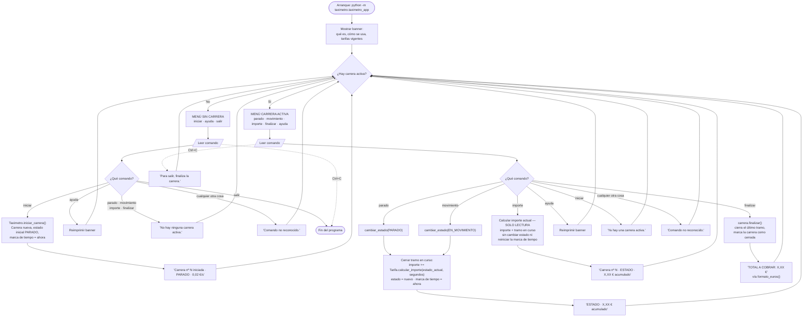

# Flujo de la aplicación — Fase 1 (US-01 a US-04)

CLI command loop for the Fase 1 MVP, decided before implementation. Covers the driver's-eye view only: what the driver types and what the app does with it. Class internals (`Carrera` / `Tarifa` / `Taximetro`) appear only where they explain a branch.

Companion docs: `docs/project-brief.md` (client requirements), `docs/decisions-fase1-scaffold.md` (structural decisions), `docs/future-implementation-ideas.md` (deferred ideas).

---

## Diagrama

Dashed arrows are Ctrl+C. Everything else is a typed command.

---

## Decisiones tomadas

Resolved during the design interview that produced this diagram. Each one is a branch someone could reasonably have drawn differently.

### Context-sensitive menus instead of one flat command list

**Decision:** the loop has two modes. Idle shows `iniciar · ayuda · salir`; an active ride shows `parado · movimiento · importe · finalizar · ayuda`. The driver only ever sees the commands that are valid right now.

**Why:** US-01 requires the driver to need no external documentation. A menu that only offers legal moves teaches itself. It also gives the diagram a single mode diamond at the top instead of a guard on every branch.

### No `salir` during an active ride

**Decision:** `salir` exists only in the idle menu. To leave mid-ride the driver runs `finalizar` first, which prints the total and returns to the idle menu — where `iniciar` (another ride) and `salir` are both offered.

**Why:** one command, one meaning — `finalizar` ends a *ride*, `salir` ends the *program*, with no overlap. It also removes the "should `salir` auto-finalizar or discard the fare?" question entirely instead of answering it, and it makes US-04 ("iniciar otra carrera sin cerrar el programa") a visible prompt rather than an implicit property of the loop.

### Ctrl+C mid-ride is swallowed

**Decision:** during an active ride, `KeyboardInterrupt` is caught, prints `'Para salir, finaliza la carrera.'` and redraws the active menu. While idle, Ctrl+C exits cleanly.

**Why:** with `salir` gone from the active menu, Ctrl+C was the only remaining way to kill a ride — by accident, losing the fare and dumping a traceback in front of the client during the demo. A ride should only ever end deliberately. Idle has nothing to lose, so there Ctrl+C just exits.

### `importe` command — read-only running total

**Decision:** an `importe` command prints the accrued amount without changing state or resetting the accrual timestamp.

**Why:** state changes already echo the running total, but a driver stuck in a ten-minute traffic jam changes state zero times and would otherwise see nothing. This is the Fase 1 answer to the client's "en tiempo real" wording.

**Consequence for implementation:** this needs a read-only accessor on `Carrera` (e.g. `importe_actual()`) returning `importe + tramo en curso` **without mutating anything**. `cambiar_estado()` and `finalizar()` keep their existing accrue-and-reset behaviour. Getting this wrong — resetting the timestamp on a read — would silently under-charge the passenger, so it deserves a dedicated test: *two `importe` calls in a row, then `finalizar`, must total the same as `finalizar` alone.*

### `ayuda` command

**Decision:** reprints the startup banner on demand, available in both modes.

**Why:** the banner scrolls off screen after a couple of rides, and US-01's "no external docs" requirement shouldn't expire the moment the terminal scrolls.

### Two distinct error paths

**Decision:** a real command used in the wrong mode gets a specific message (`'No hay ninguna carrera activa.'`, `'Ya hay una carrera activa.'`); anything unrecognised gets `'Comando no reconocido.'`.

**Why:** the two cases have different fixes — one is "start a ride first", the other is "you mistyped". Collapsing them into one message makes the driver re-read the menu to work out which mistake they made.

**Note on layering:** because the CLI knows which mode it is in, it produces these messages itself rather than calling the domain and catching an exception. `CarreraActivaError` / `CarreraFinalizadaError` remain the domain's own guarantees — unit-testable with `pytest.raises` — but in normal CLI use they should never surface, because the menu prevents reaching them.

### No live ticker in Fase 1

**Decision:** the importe is echoed after each command, not continuously refreshed. A self-updating display is deferred to the Fase 3 GUI.

**Why:** a permanently visible counter needs a background thread ticking while `input()` blocks, and the ticker's redraws corrupt whatever the driver is half-way through typing — which in turn pushes the CLI toward single-keypress, platform-specific input handling (`msvcrt` on Windows, `termios` elsewhere). That is a lot of display-layer machinery for a phase whose requisitos only ask for a correct total. Already recorded in `docs/future-implementation-ideas.md`; the timestamp-delta accrual model supports a live display unchanged whenever a later phase wants one.

---

## Trazabilidad con las historias de usuario

| Rama del diagrama | Historia | Requisito funcional de Fase 1 |
|---|---|---|
| Banner al arrancar · `ayuda` | US-01 | "El sistema explica al conductor cómo usarlo sin documentación externa" |
| `iniciar` → carrera nueva, cobro desde el arranque | US-01 | Cobro inmediato desde el inicio |
| `iniciar` bloqueado con carrera activa | US-01 | "Impedir iniciar una carrera si ya hay una activa" |
| `parado` / `movimiento` → cierre de tramo + cambio de estado | US-02 | "El conductor puede indicar en cada momento si el vehículo está parado o en movimiento" |
| Acumulación por tramos vía `Tarifa` | US-02 | "El importe se acumula de forma continua según estado activo y tiempo transcurrido" |
| `finalizar` → total vía `formato_euros()` | US-03 | "Al cerrar la carrera, el sistema muestra el importe total a cobrar" |
| Carrera cerrada no admite más cambios | US-03 | Criterio de aceptación de US-03 |
| Vuelta al menú inactivo tras `finalizar` | US-04 | "Encadenar carreras de forma inmediata, sin interrupciones" |
| `importe` | US-02 / briefing | "Calcule lo que le cuesta al pasajero en tiempo real" (alcance de Fase 1) |
