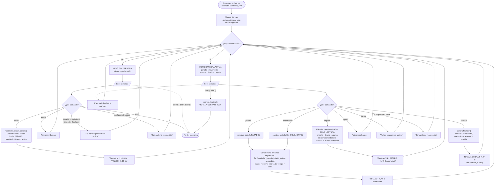

# Flujo de la aplicación — Fase 1 (US-01 a US-04)

Bucle de comandos del CLI para el MVP de Fase 1, decidido antes de implementar. Cubre solo la visión del conductor: qué escribe y qué hace la aplicación con ello. Las interioridades de las clases (`Carrera` / `Tarifa` / `Taximetro`) aparecen únicamente cuando explican una rama.

Documentos relacionados: `docs/project-brief.md` (requisitos del cliente), `docs/decisions-fase1-scaffold.md` (decisiones estructurales), `docs/decisions-proceso.md` (decisiones de proceso), `docs/future-implementation-ideas.md` (ideas aplazadas).

---

## Diagrama

Las flechas discontinuas son interrupciones del terminal (Ctrl+C y EOF). Todo lo demás es un comando escrito.

---

## Decisiones tomadas

Resueltas durante las entrevistas de diseño que produjeron este diagrama. Cada una es una rama que alguien podría razonablemente haber dibujado de otra forma.

### Menús contextuales en lugar de una lista plana de comandos

**Decisión:** el bucle tiene dos modos. Sin carrera muestra `iniciar · ayuda · salir`; con carrera activa muestra `parado · movimiento · importe · finalizar · ayuda`. El conductor solo ve los comandos válidos en ese momento.

**Por qué:** US-01 exige que el conductor no necesite documentación externa. Un menú que solo ofrece movimientos legales se enseña a sí mismo. Además, el diagrama queda con un único rombo de modo arriba en lugar de una guarda en cada rama.

### Sin `salir` durante una carrera activa

**Decisión:** `salir` existe solo en el menú sin carrera. Para salir a mitad de carrera, el conductor ejecuta antes `finalizar`, que muestra el total y devuelve el bucle al menú inactivo — donde se ofrecen tanto `iniciar` (otra carrera) como `salir`.

**Por qué:** un comando, un significado — `finalizar` termina una *carrera*, `salir` termina el *programa*, sin solaparse. También elimina por completo la pregunta "¿`salir` debería finalizar la carrera o descartar el importe?" en vez de responderla, y convierte US-04 ("iniciar otra carrera sin cerrar el programa") en una indicación visible en pantalla y no en una propiedad implícita del bucle.

### Ctrl+C a mitad de carrera se ignora

**Decisión:** durante una carrera activa se captura `KeyboardInterrupt`, se muestra `'Para salir, finaliza la carrera.'` y se vuelve a dibujar el menú activo. Sin carrera, Ctrl+C sale limpiamente.

**Por qué:** al quitar `salir` del menú activo, Ctrl+C se quedó como la única forma de matar una carrera — por accidente, perdiendo el importe y soltando un traceback delante del cliente durante la demo. Una carrera solo debería terminar de forma deliberada. Sin carrera no hay nada que perder, así que ahí Ctrl+C simplemente sale.

### EOF (Ctrl+D o entrada agotada)

**Decisión:** se captura `EOFError`. Sin carrera, sale limpiamente igual que `salir`. Con carrera activa, finaliza la carrera, muestra el **TOTAL A COBRAR** y entonces sale.

**Por qué:** `input()` lanza `EOFError` con Ctrl+D, cuando se le canaliza una entrada que se agota, y cuando la función `entrada` inyectada en los tests llega al final de su guion. Sin capturarlo, eso es un traceback al final de cada test del CLI y en cualquier demo con entrada canalizada.

A mitad de carrera **no** se comporta como Ctrl+C (mensaje y volver a preguntar): EOF no es reintentable, así que volver a leer entraría en un bucle infinito. Finalizar primero mantiene la promesa de que un importe nunca se pierde en silencio, y aun así el programa termina.

### Comando `importe` — total acumulado de solo lectura

**Decisión:** un comando `importe` muestra el importe acumulado sin cambiar el estado ni reiniciar la marca de tiempo de acumulación.

**Por qué:** los cambios de estado ya muestran el total acumulado, pero un conductor atrapado diez minutos en un atasco no cambia de estado ni una vez y, si no, no vería ningún número hasta `finalizar`. Esta es la respuesta de Fase 1 al "en tiempo real" del briefing del cliente.

**Consecuencia para la implementación:** requiere un accesor de solo lectura en `Carrera` (`importe_actual()`) que devuelva `importe + tramo en curso` **sin mutar nada**. `cambiar_estado()` y `finalizar()` conservan su comportamiento de acumular y reiniciar. Equivocarse aquí — reiniciar la marca de tiempo en una lectura — cobraría de menos al pasajero en silencio, así que merece un test dedicado: *dos llamadas seguidas a `importe`, luego `finalizar`, deben sumar lo mismo que `finalizar` a secas.*

Sobre una carrera ya cerrada, `importe_actual()` devuelve el total congelado: no sigue acumulando (ver `docs/decisions-fase1-scaffold.md`).

### Comando `ayuda`

**Decisión:** reimprime el banner de arranque a petición, disponible en ambos modos.

**Por qué:** el banner se va de la pantalla después de un par de carreras, y el requisito de US-01 de "sin documentación externa" no debería caducar en cuanto el terminal hace scroll.

### Dos caminos de error distintos

**Decisión:** un comando real usado en el modo equivocado recibe un mensaje específico (`'No hay ninguna carrera activa.'`, `'Ya hay una carrera activa.'`); cualquier cosa no reconocida recibe `'Comando no reconocido.'`.

**Por qué:** los dos casos tienen soluciones distintas — uno es "inicia una carrera primero", el otro es "te has equivocado al escribir". Fundirlos en un solo mensaje obliga al conductor a releer el menú para deducir cuál de los dos errores ha cometido.

**Nota sobre capas:** como el CLI sabe en qué modo está, produce él mismo estos mensajes en lugar de llamar al dominio y capturar una excepción. `CarreraActivaError` / `CarreraFinalizadaError` siguen siendo garantías propias del dominio — verificables con `pytest.raises` — pero en el uso normal del CLI no deberían aflorar nunca, porque el menú impide llegar a ellas.

### Sin contador en vivo en Fase 1

**Decisión:** el importe se muestra después de cada comando, no se refresca continuamente. Una pantalla que se actualiza sola queda aplazada a la GUI de Fase 3.

**Por qué:** un contador permanentemente visible necesita un hilo en segundo plano que siga corriendo mientras `input()` está bloqueado, y los repintados del contador corrompen lo que el conductor esté escribiendo a medias — lo que a su vez empuja el CLI hacia lectura de teclas sueltas dependiente de plataforma (`msvcrt` en Windows, `termios` en el resto). Es mucha maquinaria de presentación para una fase cuyos requisitos solo piden un total correcto. Está registrado en `docs/future-implementation-ideas.md`; el modelo de acumulación por marcas de tiempo admite una pantalla en vivo sin cambios cuando una fase posterior la quiera.

---

## Trazabilidad con las historias de usuario

| Rama del diagrama | Historia | Requisito funcional de Fase 1 |
|---|---|---|
| Banner al arrancar · `ayuda` | US-01 | "El sistema explica al conductor cómo usarlo sin documentación externa" |
| `iniciar` → carrera nueva, cobro desde el arranque | US-01 | Cobro inmediato desde el inicio |
| `iniciar` bloqueado con carrera activa | US-01 | "Impedir iniciar una carrera si ya hay una activa" |
| `parado` / `movimiento` → cierre de tramo + cambio de estado | US-02 | "El conductor puede indicar en cada momento si el vehículo está parado o en movimiento" |
| Acumulación por tramos vía `Tarifa` | US-02 | "El importe se acumula de forma continua según estado activo y tiempo transcurrido" |
| `finalizar` → total vía `formato_euros()` | US-03 | "Al cerrar la carrera, el sistema muestra el importe total a cobrar" |
| Carrera cerrada no admite más cambios | US-03 | Criterio de aceptación de US-03 |
| Vuelta al menú inactivo tras `finalizar` | US-04 | "Encadenar carreras de forma inmediata, sin interrupciones" |
| `importe` | US-02 / briefing | "Calcule lo que le cuesta al pasajero en tiempo real" (alcance de Fase 1) |
| EOF con carrera activa → `finalizar` + total | US-03 | El importe nunca se pierde sin mostrarse |
