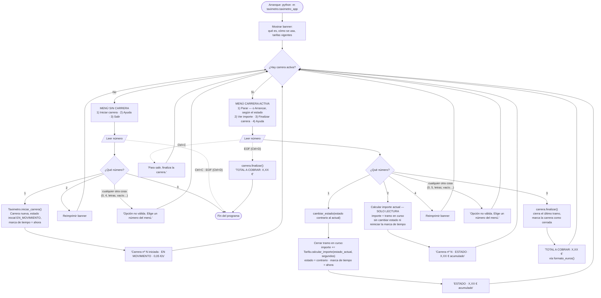

# Flujo de la aplicación — Fase 1 (US-01 a US-04)

Bucle de menú del CLI para el MVP de Fase 1, decidido antes de implementar. Cubre solo la visión del conductor: qué ve, qué teclea y qué hace la aplicación con ello. Las interioridades de las clases (`Carrera` / `Tarifa` / `Taximetro`) aparecen únicamente cuando explican una rama.

Documentos relacionados: `docs/project-brief.md` (requisitos del cliente), `docs/decisions-fase1-scaffold.md` (decisiones estructurales), `docs/decisions-proceso.md` (decisiones de proceso), `docs/future-implementation-ideas.md` (ideas aplazadas).

---

## Diagrama

Las flechas discontinuas son interrupciones del terminal (Ctrl+C y EOF). Todo lo demás es un número tecleado.

Los números son **locales a cada menú**: el `1` inicia una carrera cuando no hay ninguna y cambia el estado del vehículo cuando la hay. Solo hay un menú en pantalla a la vez, y es el que manda.

---

## Decisiones tomadas

Resueltas durante las entrevistas de diseño que produjeron este diagrama. Cada una es una rama que alguien podría razonablemente haber dibujado de otra forma.

### Menús contextuales en lugar de una lista plana de comandos

**Decisión:** el bucle tiene dos modos. Sin carrera muestra `Iniciar carrera · Ayuda · Salir`; con carrera activa muestra `Parar`/`Arrancar` · `Ver importe` · `Finalizar carrera` · `Ayuda`. El conductor solo ve las opciones válidas en ese momento.

**Por qué:** US-01 exige que el conductor no necesite documentación externa. Un menú que solo ofrece movimientos legales se enseña a sí mismo. Además, el diagrama queda con un único rombo de modo arriba en lugar de una guarda en cada rama.

### Menú numerado en lugar de comandos escritos

**Decisión:** cada opción lleva un número y el conductor teclea solo el número. Las palabras (`iniciar`, `finalizar`…) ya **no** se aceptan: son entrada no válida como cualquier otra. Los números son locales a cada menú, así que el `1` significa una cosa sin carrera y otra durante una carrera.

**Por qué:** el taxista usa esto conduciendo. Un número es una pulsación, no una palabra que haya que recordar, escribir entera y sin erratas; `movimeinto` era un error realista y molesto. Numerar por menú en lugar de dar a cada acción un número fijo evita huecos en la lista (`2 · 3 · 5 · 6`), que obligarían a leer para encontrar la tecla en vez de contar.

**Consecuencia:** un menú vertical y no una línea de opciones separadas por puntos. Ocupa más pantalla en cada vuelta del bucle, y se acepta a cambio de que el número y su etiqueta se lean de un vistazo. El menú se imprime precedido de una línea en blanco, para que se despegue del mensaje que acaba de salir.

**Alternativa descartada:** aceptar también las palabras como alias oculto. Habría mantenido intactos los tests y los dos errores diferenciados, pero deja el menú mintiendo sobre lo que admite y obliga a mantener dos vocabularios de entrada.

### Una sola opción que alterna el estado, no dos

**Decisión:** durante una carrera hay **una** opción de estado, no dos. El menú ofrece siempre la acción contraria a la situación actual: `Parar` si el taxi está en movimiento, `Arrancar` si está parado. La etiqueta se calcula desde `carrera.estado`; la acción es `cambiar_estado()` al estado contrario.

**Por qué:** con dos opciones fijas, una de las dos siempre era el estado en el que el taxi ya estaba — una tecla que no hace nada, ofrecida con la misma prominencia que la que sí. Con una sola, el conductor no tiene que leer en qué estado está para decidir qué pulsar: el `1` siempre es "ha cambiado lo que está haciendo el taxi". De paso el menú activo baja de cinco opciones a cuatro.

**Consecuencia:** `cambiar_estado()` conserva su no-op silencioso al repetir estado (está probado en `test_carrera.py`), pero el CLI ya no puede provocarlo. Sigue siendo una garantía del dominio, no del menú.

### La carrera nace EN MOVIMIENTO

**Decisión:** una carrera recién iniciada arranca en `EN_MOVIMIENTO`, cobrando a 0,05 €/s desde el primer segundo.

**Por qué:** la carrera se inicia cuando el taxi arranca con el pasajero ya dentro, no mientras lo espera. Arrancar en `PARADO` cobraba la tarifa baja durante los primeros segundos de trayecto real. Si el taxi arranca detenido — atrapado en el tráfico al salir —, el conductor pulsa `Parar`, que es una sola tecla.

**Consecuencia:** el primer tramo de toda carrera es el caro, y los tests de acumulación de `test_carrera.py` se recalcularon sobre 0,05 €/s. Invierte también el orden del guion de la demo: primero se circula y luego se para en el semáforo.

### Sin `Salir` durante una carrera activa

**Decisión:** `Salir` existe solo en el menú sin carrera. Para salir a mitad de carrera, el conductor elige antes `Finalizar carrera`, que muestra el total y devuelve el bucle al menú inactivo — donde se ofrecen tanto `Iniciar carrera` como `Salir`.

**Por qué:** una opción, un significado — `Finalizar carrera` termina una *carrera*, `Salir` termina el *programa*, sin solaparse. También elimina por completo la pregunta "¿`Salir` debería finalizar la carrera o descartar el importe?" en vez de responderla, y convierte US-04 ("iniciar otra carrera sin cerrar el programa") en una indicación visible en pantalla y no en una propiedad implícita del bucle.

### Ctrl+C a mitad de carrera se ignora

**Decisión:** durante una carrera activa se captura `KeyboardInterrupt`, se muestra `'Para salir, finaliza la carrera.'` y se vuelve a dibujar el menú activo. Sin carrera, Ctrl+C sale limpiamente.

**Por qué:** al quitar `Salir` del menú activo, Ctrl+C se quedó como la única forma de matar una carrera — por accidente, perdiendo el importe y soltando un traceback delante del cliente durante la demo. Una carrera solo debería terminar de forma deliberada. Sin carrera no hay nada que perder, así que ahí Ctrl+C simplemente sale.

### EOF (Ctrl+D o entrada agotada)

**Decisión:** se captura `EOFError`. Sin carrera, sale limpiamente igual que `Salir`. Con carrera activa, finaliza la carrera, muestra el **TOTAL A COBRAR** y entonces sale.

**Por qué:** `input()` lanza `EOFError` con Ctrl+D, cuando se le canaliza una entrada que se agota, y cuando la función `entrada` inyectada en los tests llega al final de su guion. Sin capturarlo, eso es un traceback al final de cada test del CLI y en cualquier demo con entrada canalizada.

A mitad de carrera **no** se comporta como Ctrl+C (mensaje y volver a preguntar): EOF no es reintentable, así que volver a leer entraría en un bucle infinito. Finalizar primero mantiene la promesa de que un importe nunca se pierde en silencio, y aun así el programa termina.

### Opción `Ver importe` — total acumulado de solo lectura

**Decisión:** una opción `Ver importe` muestra el importe acumulado sin cambiar el estado ni reiniciar la marca de tiempo de acumulación.

**Por qué:** los cambios de estado ya muestran el total acumulado, pero un conductor atrapado diez minutos en un atasco no cambia de estado ni una vez y, si no, no vería ningún número hasta `Finalizar carrera`. Esta es la respuesta de Fase 1 al "en tiempo real" del briefing del cliente.

**Consecuencia para la implementación:** requiere un accesor de solo lectura en `Carrera` (`importe_actual()`) que devuelva `importe + tramo en curso` **sin mutar nada**. `cambiar_estado()` y `finalizar()` conservan su comportamiento de acumular y reiniciar. Equivocarse aquí — reiniciar la marca de tiempo en una lectura — cobraría de menos al pasajero en silencio, así que merece un test dedicado: *dos llamadas seguidas a `Ver importe`, luego `Finalizar carrera`, deben sumar lo mismo que finalizar a secas.*

Sobre una carrera ya cerrada, `importe_actual()` devuelve el total congelado: no sigue acumulando (ver `docs/decisions-fase1-scaffold.md`).

### Opción `Ayuda`

**Decisión:** reimprime el banner de arranque a petición, disponible en ambos modos.

**Por qué:** el banner se va de la pantalla después de un par de carreras, y el requisito de US-01 de "sin documentación externa" no debería caducar en cuanto el terminal hace scroll.

### Un único camino de error

**Decisión:** solo hay un mensaje de error, `'Opción no válida. Elige un número del menú.'`, y la carrera queda exactamente como estaba.

**Por qué:** esta decisión sustituye a la anterior (dos mensajes distintos: uno para un comando real usado en el modo equivocado, otro para una errata). Con el menú numerado, el caso "comando correcto, modo equivocado" **deja de existir**: no hay ninguna tecla que finalice una carrera que no existe, ni ninguna que abra una segunda carrera mientras hay una abierta, porque esas opciones no están en el menú que se está mostrando. Al quedar un solo caso posible, dos mensajes serían dos nombres para lo mismo.

El error queda prevenido en vez de reportado, que era el objetivo de fondo de aquella decisión.

**Nota sobre capas:** el CLI valida el número contra el menú del modo actual, así que no necesita llamar al dominio para descubrir que algo no se puede hacer. `CarreraActivaError` / `CarreraFinalizadaError` siguen siendo garantías propias del dominio — verificables con `pytest.raises` — pero desde el CLI ya son inalcanzables por construcción.

### Sin contador en vivo en Fase 1

**Decisión:** el importe se muestra después de cada opción elegida, no se refresca continuamente. Una pantalla que se actualiza sola queda aplazada a la GUI de Fase 3.

**Por qué:** un contador permanentemente visible necesita un hilo en segundo plano que siga corriendo mientras `input()` está bloqueado, y los repintados del contador corrompen lo que el conductor esté escribiendo a medias — lo que a su vez empuja el CLI hacia lectura de teclas sueltas dependiente de plataforma (`msvcrt` en Windows, `termios` en el resto). Es mucha maquinaria de presentación para una fase cuyos requisitos solo piden un total correcto. Está registrado en `docs/future-implementation-ideas.md`; el modelo de acumulación por marcas de tiempo admite una pantalla en vivo sin cambios cuando una fase posterior la quiera.

---

## Trazabilidad con las historias de usuario

| Rama del diagrama | Historia | Requisito funcional de Fase 1 |
|---|---|---|
| Banner al arrancar · `Ayuda` | US-01 | "El sistema explica al conductor cómo usarlo sin documentación externa" |
| Menú numerado: se teclea un número, no un comando | US-01 | "El sistema explica al conductor cómo usarlo sin documentación externa" |
| `1) Iniciar carrera` → carrera nueva, cobro desde el arranque | US-01 | Cobro inmediato desde el inicio |
| Sin opción de iniciar en el menú de carrera activa | US-01 | "Impedir iniciar una carrera si ya hay una activa" |
| `1) Parar` / `1) Arrancar` → cierre de tramo + cambio de estado | US-02 | "El conductor puede indicar en cada momento si el vehículo está parado o en movimiento" |
| Acumulación por tramos vía `Tarifa` | US-02 | "El importe se acumula de forma continua según estado activo y tiempo transcurrido" |
| `3) Finalizar carrera` → total vía `formato_euros()` | US-03 | "Al cerrar la carrera, el sistema muestra el importe total a cobrar" |
| Carrera cerrada no admite más cambios | US-03 | Criterio de aceptación de US-03 |
| Vuelta al menú inactivo tras finalizar | US-04 | "Encadenar carreras de forma inmediata, sin interrupciones" |
| `2) Ver importe` | US-02 / briefing | "Calcule lo que le cuesta al pasajero en tiempo real" (alcance de Fase 1) |
| EOF con carrera activa → finalizar + total | US-03 | El importe nunca se pierde sin mostrarse |
