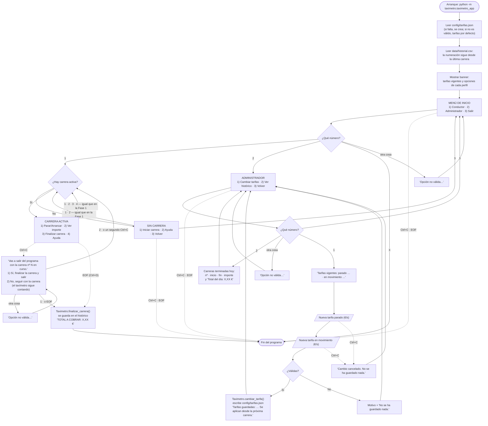

# Flujo de la aplicación — Fase 2

Cómo cambia el CLI en la Fase 2. Se añade un **menú de inicio** que separa dos perfiles, Conductor y Administrador, y se revisa qué hace `Ctrl+C` durante una carrera. Este documento cubre la **US-07** (tarifas configurables) y la **US-05** (histórico de carreras).

Todo lo que no aparece aquí sigue igual que en [`flujo-fase1.md`](flujo-fase1.md): iniciar, parar/arrancar, ver importe, finalizar, ayuda y opción no válida. Las razones de cada decisión están en [`decisions-fase2.md`](decisions-fase2.md).

---

## Diagrama



Las flechas discontinuas son interrupciones del terminal. Todo lo demás es un número tecleado. Los números siguen siendo **locales a cada menú**.

---

## Decisiones visibles

### Se elige perfil al arrancar

El programa abre en el menú de inicio. **Conductor** es el taxímetro de la Fase 1. **Administrador** reúne las funciones de gestión: cambiar las tarifas y ver el histórico del día.

`Salir` solo existe en el menú de inicio. Los menús de Conductor y Administrador tienen `Volver`, y el del conductor solo lo ofrece **sin carrera en curso**. Por eso nunca se puede llegar al Administrador con una carrera abierta, y al pasajero siempre se le cobra la tarifa que se anunció al iniciar su carrera.

En la Fase 2 el Administrador **no pide contraseña**. La contraseña llega con la US-08 (Fase 3), y este menú ya deja preparado dónde irá.

### Cambiar tarifas

- Se piden las dos tarifas en €/s. Se admite coma o punto decimal: `0,03` o `0.03`.
- Reglas: cada tarifa mayor que 0 y como máximo 1,00 €/s, con 2 decimales como mucho, y la de parado no mayor que la de en movimiento.
- Si algo no cumple, se explica el motivo, **no se guarda nada** y se vuelve al menú de Administrador.
- Si es válido, se escribe `config/tarifas.json` y la tarifa nueva se aplica **desde la próxima carrera**. La carrera ya cobrada conserva la suya.
- Si el fichero no se puede escribir, no se cambia nada: el fichero y el taxímetro nunca discrepan.

Mensajes posibles:

| Situación | Mensaje |
|---|---|
| No es un número | `«abc» no es un número. Escribe, por ejemplo, 0,03. No se ha guardado nada.` |
| 0, negativa o más de 1 €/s | `Cada tarifa debe ser mayor que 0 y como máximo 1,00 €/s. No se ha guardado nada.` |
| Más de 2 decimales | `Cada tarifa admite como máximo 2 decimales. No se ha guardado nada.` |
| Parado mayor que en movimiento | `La tarifa parado no puede ser mayor que la de en movimiento. No se ha guardado nada.` |
| Fichero no escribible | `No se pudo escribir el fichero de tarifas. No se ha guardado nada.` |
| Ctrl+C mientras se teclea | `Cambio cancelado. No se ha guardado nada.` |

### Ver histórico

Muestra las carreras **terminadas hoy** y el total de caja:

```
Histórico de hoy · 21/09/2026
    Nº  Inicio    Fin          Importe
     1  08:00:00  08:01:00      3,00 €
     2  08:01:00  08:01:20      1,00 €
  2 carreras · Total del día: 4,00 €
```

Sin carreras hoy: `No hay carreras terminadas hoy.` Una carrera que empieza antes de medianoche y termina después cuenta para el día en que **termina**, que es cuando se cobra.

- **Toda carrera terminada se guarda**, termine como termine: con *Finalizar carrera*, con `Ctrl+C` → *Sí* o con `Ctrl+D`.
- Se guarda el **importe cobrado**, en céntimos, el mismo que salió en `TOTAL A COBRAR`: el total del día es la suma exacta de los tickets.
- La **numeración de carreras continúa** entre sesiones: si ayer se cerró la nº 7, la primera de hoy es la nº 8. Así nunca hay dos carreras con el mismo número en el histórico.
- Si el histórico no se puede escribir, la carrera se cierra y el total se muestra igualmente, seguido de `Aviso: no se pudo guardar la carrera en el histórico. Anota el total.`
- Si no se puede leer: `No se pudo leer el histórico.`

El fichero es `data/historial.csv`, una fila por carrera, y se puede abrir con una hoja de cálculo:

```
carrera,hora_inicio,hora_fin,importe,distancia
1,2026-09-21T08:00:00,2026-09-21T08:01:00,3.00,0.00
```

Nunca se reescribe, solo se le añaden filas: un cierre inesperado no puede estropear las carreras anteriores. No se versiona en git.

### El fichero de tarifas

`config/tarifas.json`, en €/s:

```json
{
  "parado": 0.02,
  "en_movimiento": 0.05
}
```

Un técnico puede editarlo a mano con el programa cerrado. Se lee al arrancar. Si falta, se crea con las tarifas por defecto. Si no es válido, el programa arranca igualmente con las tarifas por defecto y **no toca el fichero**, para que el técnico pueda ver y corregir su error. El repositorio incluye `config/tarifas.example.json` como referencia del formato; el `tarifas.json` real no se versiona.

### Ctrl+C durante una carrera pide confirmación

En la Fase 1, `Ctrl+C` a mitad de carrera se ignoraba con un aviso. En la Fase 2 pregunta:

```
Vas a salir del programa con la carrera nº 1 en curso.
  1) Sí, finalizar la carrera y salir
  2) No, seguir con la carrera
```

- **Mientras se pregunta, el taxímetro sigue contando** tiempo y dinero.
- **No** vuelve a la carrera como si nada hubiera pasado.
- **Sí** finaliza la carrera, la guarda en el histórico, muestra `TOTAL A COBRAR` y cierra el programa.
- Un **segundo Ctrl+C** cuenta como *No*: un doble toque por nervios no termina una carrera.
- **EOF** (`Ctrl+D`) cuenta como *Sí*, igual que EOF durante una carrera en la Fase 1.

Fuera de una carrera (menú de inicio, Administrador, conductor sin carrera), `Ctrl+C` y `Ctrl+D` cierran el programa directamente: no hay importe que perder.
