# Flujo de la aplicación — Fase 3

Cómo se enlazan las pantallas de la interfaz gráfica (**US-09**) y dónde entra la contraseña (**US-08**). La interfaz gráfica pasa a ser la principal; el CLI de [`flujo-fase2.md`](flujo-fase2.md) sigue existiendo como segunda forma de arrancar, con la contraseña también delante de su Administrador.

Lo que se ve en cada pantalla está en [`diseno-interfaz-fase3.md`](diseno-interfaz-fase3.md); las razones de cada decisión, en [`decisions-fase3.md`](decisions-fase3.md).

---

## Diagrama

```mermaid
flowchart TD
    START(["Arranque de la interfaz gráfica"]) --> CONF["Leer config/tarifas.json y data/historial.csv<br/>(igual que en la Fase 2)"]
    CONF --> INICIO

    %% ============ INICIO ============
    INICIO["1 · INICIO<br/>CONDUCTOR · ADMINISTRADOR · Salir"]
    INICIO -->|CONDUCTOR| LIBRE
    INICIO -->|ADMINISTRADOR| PASS
    INICIO -->|"Salir · ✕"| FIN(["Fin del programa"])

    %% ============ CONDUCTOR ============
    LIBRE["3 · TAXÍMETRO — LIBRE<br/>visor: 0,00 o TOTAL A COBRAR de la última carrera<br/>INICIAR CARRERA · Ayuda · Volver"]
    LIBRE -->|INICIAR CARRERA| OCUP
    LIBRE -->|Volver| INICIO
    LIBRE -->|"✕"| FIN

    OCUP["4 · TAXÍMETRO — OCUPADO<br/>importe en tiempo real<br/>PARAR/ARRANCAR · FINALIZAR · Ayuda"]
    OCUP -->|"PARAR / ARRANCAR"| OCUP
    OCUP -->|FINALIZAR| CONF_FIN["¿Finalizar la carrera nº N?<br/>SÍ, FINALIZAR · NO, SEGUIR"]
    CONF_FIN -->|"NO, SEGUIR"| OCUP
    CONF_FIN -->|"SÍ, FINALIZAR"| CIERRE["Taximetro.finalizar_carrera()<br/>se guarda en el histórico"]
    CIERRE --> LIBRE

    OCUP -.->|"✕ (cerrar la ventana)"| CONF_SALIR["Vas a salir del programa con la carrera nº N en curso.<br/>SÍ, FINALIZAR Y SALIR · NO, SEGUIR"]
    CONF_SALIR -->|"NO, SEGUIR · o un segundo ✕"| OCUP
    CONF_SALIR -->|"SÍ, FINALIZAR Y SALIR"| CIERRE_SALIR["Taximetro.finalizar_carrera()<br/>se guarda en el histórico<br/>visor: TOTAL A COBRAR · tecla CERRAR"]
    CIERRE_SALIR -->|CERRAR| FIN

    %% ============ ADMINISTRADOR ============
    PASS["2 · CONTRASEÑA<br/>ENTRAR · Cancelar"]
    PASS -->|correcta| ADMIN
    PASS -->|"incorrecta o vacía: mensaje"| PASS
    PASS -->|Cancelar| INICIO

    ADMIN["6 · ADMINISTRADOR<br/>CAMBIAR TARIFAS · VER HISTÓRICO · Volver"]
    ADMIN -->|CAMBIAR TARIFAS| TAR["7 · CAMBIAR TARIFAS<br/>GUARDAR · Volver"]
    TAR -->|"GUARDAR: válida → se guarda · no válida → mensaje"| TAR
    TAR -->|Volver| ADMIN
    ADMIN -->|VER HISTÓRICO| HIST["8 · HISTÓRICO DE HOY<br/>▲ ▼ · Volver"]
    HIST -->|Volver| ADMIN
    ADMIN -->|Volver| INICIO
    ADMIN -->|"✕"| FIN
```

*Ayuda* (en las pantallas 3 y 4) abre un panel encima y **Cerrar** vuelve a la misma pantalla; no se dibuja para no cargar el diagrama. Cerrar la ventana (✕) desde las pantallas 2, 7 y 8 también termina el programa, como desde Inicio y Administrador.

---

## Correspondencia CLI → interfaz gráfica

Cada menú y cada regla del CLI de la Fase 2, y cómo se traduce a la interfaz. Sirve para comprobar que no se pierde ningún comportamiento por el camino.

| CLI (Fase 2) | Interfaz gráfica (Fase 3) |
|---|---|
| Menú de inicio: Conductor · Administrador · Salir | Pantalla 1, Inicio: tejas CONDUCTOR y ADMINISTRADOR; Salir en el lateral |
| (no existía) | Pantalla 2, contraseña antes del Administrador (US-08). También se añade al CLI (ver *Contraseña en el CLI*) |
| Conductor sin carrera: Iniciar · Ayuda · Volver | Pantalla del taxímetro en estado **LIBRE**: tecla INICIAR CARRERA; Volver y Ayuda en el lateral |
| Carrera activa: Parar/Arrancar · Ver importe · Finalizar · Ayuda | Misma pantalla en estado **OCUPADO**: teclas PARAR/ARRANCAR y FINALIZAR; Ayuda en el lateral. *Ver importe* desaparece: el importe está siempre en pantalla |
| Finalizar → "TOTAL A COBRAR: X,XX €" | FINALIZAR pide confirmación (SÍ, FINALIZAR / NO, SEGUIR); al confirmar, el total se queda congelado en el visor y la pantalla pasa a LIBRE |
| Ctrl+C con carrera: confirmación Sí/No | Cerrar la ventana (✕) con carrera: la misma confirmación, con teclas SÍ, FINALIZAR Y SALIR / NO, SEGUIR. Un segundo ✕ cuenta como NO. En las dos interfaces el importe se congela al preguntar (ver abajo) |
| Ctrl+C / EOF sin carrera: sale | Cerrar la ventana (✕) sin carrera: sale sin preguntar |
| EOF con carrera: finaliza y sale | No existe en la interfaz gráfica (no hay entrada estándar que se cierre) |
| Administrador: Cambiar tarifas · Ver histórico · Volver | Pantalla 6: tejas CAMBIAR TARIFAS y VER HISTÓRICO; Volver en el lateral |
| Cambiar tarifas: se teclean las dos | Pantalla 7: campos rellenos con las tarifas vigentes; mismas reglas y mensajes |
| Ver histórico: tabla + total del día | Pantalla 8: tabla con filas grandes, ▲ ▼ para desplazarse, total en estilo visor |
| Opción no válida | Desaparece: con teclas no se puede elegir una opción que no existe |

## Congelar el importe al pedir el cierre (T9.8)

**Decidido (2026-09-23), para las dos interfaces:** al pedir cerrar una carrera (FINALIZAR o ✕ en la interfaz gráfica, Ctrl+C en el CLI) se congela el importe de ese instante, y la pregunta lo muestra.

- **Sí:** se cobra el importe congelado, y la hora de fin es la de la pulsación. El pasajero no paga lo que se tarda en contestar.
- **No:** la carrera sigue como si no se hubiera parado. El tiempo de la pregunta se cobra, porque el taxi seguía ocupado.
- **Cambia la regla de la Fase 2** («el taxímetro sigue contando mientras se pregunta», `flujo-fase2.md`): el CLI añade la línea «Importe a cobrar: X,XX €» bajo la pregunta del Ctrl+C.
- *Finalizar carrera* del menú del CLI no pregunta, así que cierra en el acto, como antes.

## Contraseña en el CLI (T8.5)

**Decidido (2026-09-23):** las mismas reglas que la pantalla 2, adaptadas a la terminal.

- Al elegir **2) Administrador** en el menú de inicio: `Contraseña (Intro vacío para volver): `. Lo tecleado no se ve.
- **Correcta:** menú de Administrador. Al volver al inicio y entrar otra vez, se pide de nuevo.
- **Incorrecta:** «Contraseña incorrecta. Inténtalo de nuevo.» y se vuelve a pedir, sin límite de intentos.
- **Línea vacía o Ctrl+C:** hace de *Cancelar* y vuelve al menú de inicio. (En la interfaz gráfica, vacía muestra «Escribe la contraseña.», porque allí existe la tecla Cancelar.)
- **Credenciales ilegibles:** «No se puede comprobar la contraseña. Avisa al equipo técnico.» y vuelta al menú de inicio. No se vuelve a pedir, porque reintentar no arregla un fichero.
- **EOF (Ctrl+D / fin de la entrada):** cierra el programa, igual que en el resto de menús fuera de una carrera.

## Cerrar la ventana con una carrera en curso

**Decidido (2026-09-22):** la misma confirmación que el Ctrl+C de la Fase 2.

- Panel encima de la pantalla: «Vas a salir del programa con la carrera nº N en curso.», con **SÍ, FINALIZAR Y SALIR** a la izquierda y **NO, SEGUIR** a la derecha (misma disposición que el panel de FINALIZAR).
- **NO, SEGUIR**, o un segundo ✕: vuelve a la carrera como si nada. Un doble clic nervioso nunca termina una carrera.
- **SÍ, FINALIZAR Y SALIR:** se finaliza la carrera y se guarda en el histórico.
- El importe se congela al pulsar ✕ (misma regla que FINALIZAR): **SÍ** cobra el de ese instante; **NO** sigue como si nada, cobrando también el tiempo de la pregunta.
- ✕ con el panel de FINALIZAR abierto también cuenta como NO: cierra el panel y la carrera sigue.

*Supuesto:* en el CLI, *Sí* imprime el total y termina. En una ventana, cerrarla en el acto escondería el total antes de que el pasajero lo vea. Por eso, tras *SÍ*, el visor muestra **TOTAL A COBRAR** y una sola tecla **CERRAR**; el programa termina al pulsarla.
